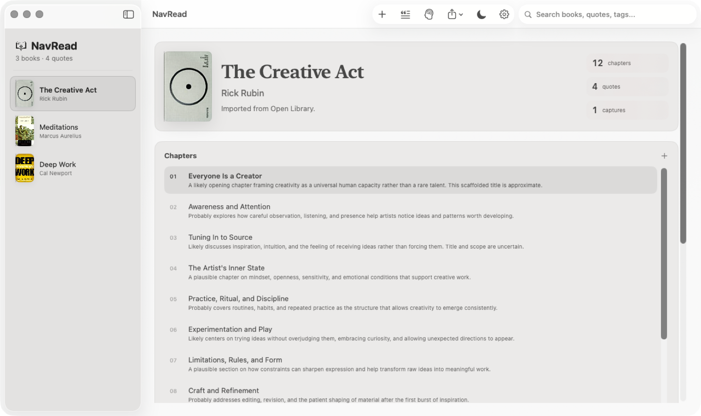
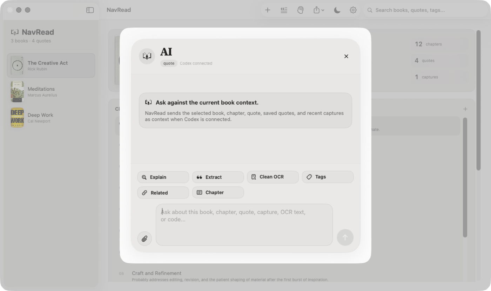
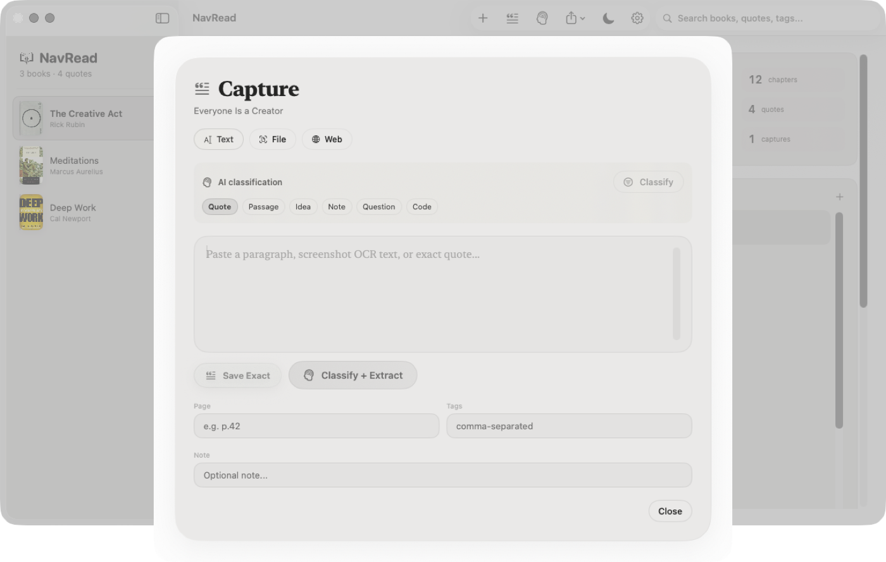

<p align="center">
  
</p>

<h1 align="center">NavRead</h1>

<p align="center">
  Save quotes, passages, screenshots, PDFs, and web highlights into one private reading library on your Mac.
</p>

<p align="center">
  <a href="https://github.com/psagar29/navread/releases/latest/download/NavRead.dmg"><strong>Download NavRead.dmg</strong></a>
  ·
  <a href="https://github.com/psagar29/navread/releases/latest">Latest release</a>
</p>

<p align="center">
  
  
  
  
</p>

---

## Download

**[Download the latest DMG](https://github.com/psagar29/navread/releases/latest/download/NavRead.dmg)**

Install:

1. Download `NavRead.dmg`.
2. Open the DMG.
3. Drag `NavRead.app` into `Applications`.
4. Open NavRead from Spotlight, Launchpad, or your Applications folder.

If macOS says the developer cannot be verified, right-click `NavRead.app`, choose `Open`, then confirm. This early build is not notarized yet.

## What NavRead Does

NavRead is a reading desk for people who collect ideas from books.

Instead of leaving quotes scattered across Notes, screenshots, PDFs, and browser tabs, NavRead keeps them organized by:

- book
- chapter
- page or location
- tags
- notes
- original source

Add a book title, and NavRead looks up the cover and book details automatically. Then you can save quotes manually, import PDFs, drop images, extract web pages, clean OCR text, and ask Codex to help classify or explain what you captured.

## Screenshots

### Reading Library



### AI Assistant



### Quote Capture



## Main Features

### Add Books Quickly

Type a book title. NavRead searches book metadata providers, downloads the cover, stores it locally, and creates an editable chapter outline.

### Save Quotes With Context

Every quote belongs somewhere useful: a book, a chapter, and optionally a page or location. Later, search finds the quote and the surrounding context.

### Capture From PDFs, Images, Text, and Links

NavRead can save from:

- pasted text
- screenshots and images with OCR
- PDF files
- web links
- manual notes
- code snippets

### Ask Codex

Connect Codex during onboarding or from Settings. Codex powers:

- chapter scaffolds
- OCR cleanup
- quote extraction
- tag suggestions
- passage explanations
- related quote lookup
- AI chat with PDF, image, text, and link attachments

NavRead only sends the selected book, chapter, quote, capture, or attachment context needed for the action you start.

### Search Everything

Search by book title, author, quote text, tags, notes, or saved source text.

### Share Quote Cards

Create quote cards in square, story, or landscape format. Save them as PNG files, copy them, or share through the macOS share sheet.

### Local-First Storage

Your reading library is stored on your Mac.

| Data | Location |
| --- | --- |
| Database | `~/Library/Application Support/NavRead/NavRead.sqlite` |
| Book covers | `~/Library/Application Support/NavRead/Assets/Covers/` |
| Captures | `~/Library/Application Support/NavRead/Assets/Captures/` |
| Quote cards | `~/Library/Application Support/NavRead/Assets/Cards/` |

Book covers are runtime cache files. They are created when users add books and are not committed to this repository.

## For Developers

NavRead is a native macOS app built with SwiftUI.

Requirements:

- macOS 15.0 or later
- Swift 6.2+
- Xcode Command Line Tools

Build and run:

```bash
git clone https://github.com/psagar29/navread.git
cd navread
./script/build_and_run.sh
```

Other commands:

```bash
./script/build_and_run.sh --verify
./script/build_and_run.sh --logs
./script/build_and_run.sh --telemetry
```

Project structure:

```text
NavRead/
├── Sources/NavRead/App/        # app entry point
├── Sources/NavRead/Models/     # books, chapters, quotes, captures
├── Sources/NavRead/Views/      # SwiftUI screens and sheets
├── Sources/NavRead/Stores/     # app state and SQLite persistence
├── Sources/NavRead/Services/   # metadata, covers, OCR, AI, sharing
├── Sources/NavRead/Support/    # design system, paths, settings
├── Sources/NavRead/Resources/  # app icon and logo assets
├── Tests/                      # unit tests
└── script/                     # build and packaging helpers
```

Run tests:

```bash
swift test
```

## License

MIT License. See [LICENSE](LICENSE).

## Author

Built by [Pranav Sagar](https://github.com/psagar29).
